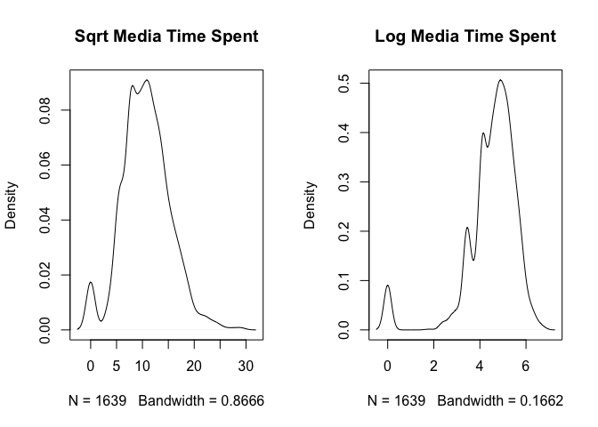
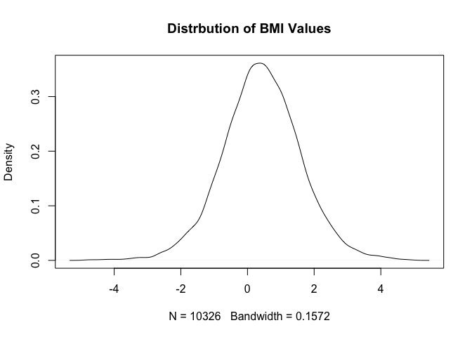
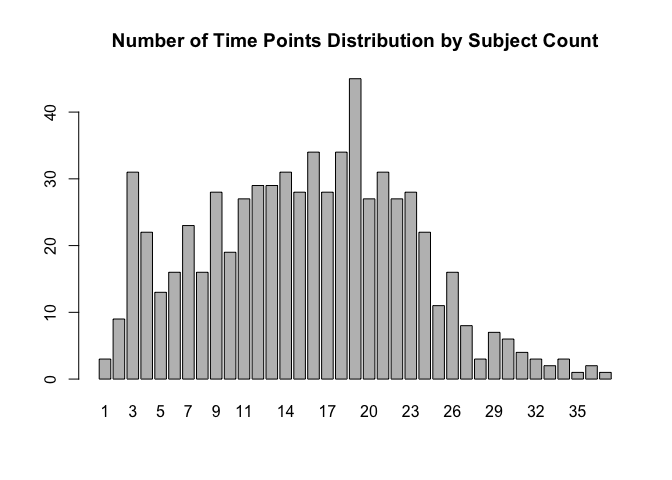
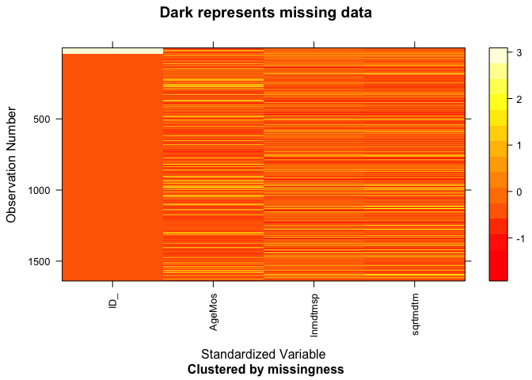
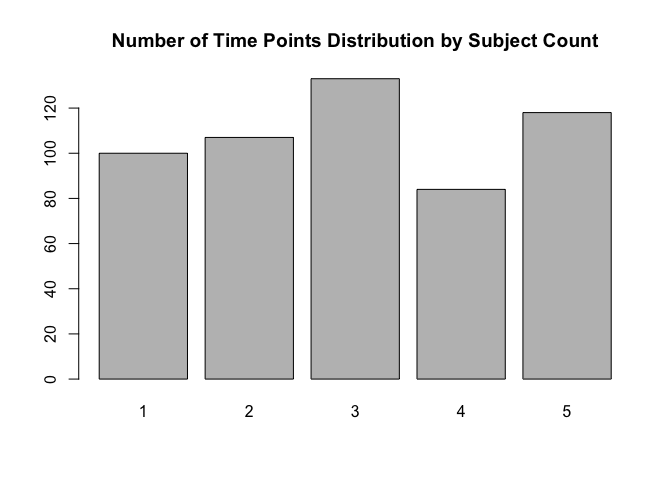
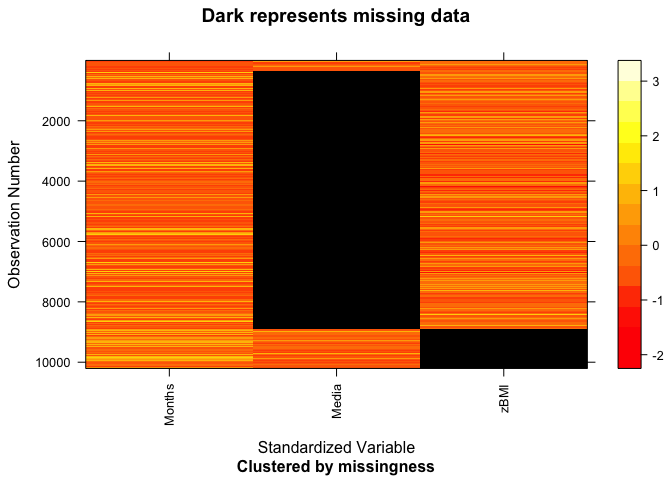

Linear Interpolation
================
Zarni Htet
March 15, 2018

### Introduction

The goal of this code file is to generate an imputed data set of **BMI** and **Media Exposure** for young children from low- income families. The existing raw data set has been linearly interpolated to fill in the missing values for **BMI** and **Media Exposure** at missing time points. A sample of the raw data set along with the existing issue and one proposed method for resolution is demonstrated in the objective section below.

### Datasets Involved

The data is from a larger study carried out under the Bellevue Project for Early Language, Literacy and Education Success. It is a longitudinal analysis of interventions related to child development in low-income families. The criteria for entry into the program is as below.

#### Mother

-   English or Spanish speaking
-   18 years and above

#### Child

-   Full-term gestation, normal birth weight
-   No significant medical complications
-   Planned to follow up in the host institution of the study

*The data is under strict confidentiality agreements and thus, not available for public disclosure.*

### Admnistration

Professor Marc Scott and Professor Daphna Harel are the supervisors of this project. The data is from the Belle Lab at the Bellevue Hospital. Additional background on the project is in the *README* at the root directory of the Github repository associated with the project.

#### R Libraries

This block has all the *required* libraries for this code file.

``` r
#For the dta raw files
library(foreign)
#For importing different types of data set without specification
library(rio)
#For processing long form data
library(dplyr)
#GTools library for ordering numeric variables
library(gtools)
#For filling NA values
library(tidyr)
#Loading Rmarkdown library for rendering
library(rmarkdown)
#knitr library for rendering
library(knitr)
#for missing data
library(mi)
#Sourcing the code file
source("../zarni/01b_Function_LInterpolation.R")
```

#### I: Uploading Raw data

In this section, the raw data is processed to a .csv format. The data files will then be saved to a processing data folder to protect the integrity of the raw data.

``` r
#The BMI data extract
bmi <- read.dta("../../data/raw/MASextract1.dta")
#The Media data extract
media <- read.dta("../../data/raw/MASextract2.dta")
#Writing the BMI data to processing file
write.csv(bmi, "../../data/processing/bmi.csv", row.names = F)
#Writing the media data to processing file
write.csv(media, "../../data/processing/media.csv", row.names = F)
```

### Objective

The overarching goal of the project is to assess whether infant media exposure is associated with weight/bmi trajectories during their infant to early childhood periods. In order to examine that association, media exposure data and weight/bmi data need to be synchronized (exactly how the response will be modeled as a function of the predictors is to be determined, but a first step is examining aligned data). As can be seen below in our short data snippet, media exposure and weight/bmi are collected at **asynchronous** time points. Our goal is to impute these missing data at missing time points via **linear interpolation**. For more on **linear interpolation**, please see the *Appendix* section.

    ##   ID_    AgeMos     zBMI lnmediatimespent sqrtmediatimespent
    ## 7   1  7.786448       NA         5.463832           15.32971
    ## 8   1 12.813142 1.011972               NA                 NA
    ## 9   1 15.244353       NA         4.948760           11.83216

#### II: Data Exploration

This section examines the two datasets. The focus here is to explore the distribution of BMI and Media Exposure as well as cases of missing data and distribution of time points for each data set.

##### The BMI data set overview

    ##    ID_     AgeMos       zBMI
    ## 1    1  0.0000000 -3.5407891
    ## 2    1  0.1314168 -3.1878707
    ## 3    1  0.5585216 -0.2831618
    ## 4    1  1.5441478 -1.2716171
    ## 5    1  4.3039017 -1.1837007
    ## 6    1  6.3737168 -2.5585830
    ## 7    1 12.8131418  1.0119723
    ## 8    2  0.0000000  1.2820979
    ## 9    2  1.5441478  2.6198270
    ## 10   2  2.5297742  1.0224092
    ## 11   2  6.7351131  1.0519278
    ## 12   2 10.8418894  1.9389179
    ## 13   2 11.7289524  0.9665915
    ## 14   2 26.4147835  1.7445436
    ## 15   2 38.6365509  2.4713204

Each subject has different time points. For subject 1, months may be 0, 0.13 , 0.55 while subject 2 has months in 0, 1.5, 2.5 etc.

###### Missing data exploration

As can be seen from the visuals below, the BMI dataset by itself before joining across subjectID and time with the Media Exposure dataset has no missing values.

``` r
mdf_bmi = missing_data.frame(p_bmi)
```

``` r
image(mdf_bmi)
```



###### Distribution of BMI values

The BMI values are more or less normalized as can be seen below.

``` r
plot(density(p_bmi$zBMI), main = "Distrbution of BMI Values")
```



###### Distribution of Number of Time Intervals by Subject Count for BMI

The number of time points counted over the number of subject ID within each count of time points can be seen below. The majority of the subjects appear to have between 11 and 23 time points.



The count of time points per subject ID is also calculated. As shown below, at least one subject ID has only **1** timepoint and **39** timepoints respectively. This insight is useful in that the built-in linear interpolation cannot impute data with only one time point. Therefore, those cases will have to be handled separately.

``` r
bmi_timed <- p_bmi %>% 
  group_by(ID_) %>%
  summarize(n = n()) 
print(max(bmi_timed$n))
```

    ## [1] 39

``` r
print(min(bmi_timed$n))
```

    ## [1] 1

##### Media exposure data set overview

    ##    ID_    AgeMos lnmediatimespent sqrtmediatimespent
    ## 1    1  7.786448         5.463832          15.329710
    ## 2    1 15.244353         4.948760          11.832160
    ## 3    2  6.735113         4.330733           8.660254
    ## 4    2 24.147844         4.795791          10.954452
    ## 5    2 42.940453         3.433987           5.477226
    ## 6    2 60.714581         4.795791          10.954452
    ## 7    3  9.494866         5.888878          18.973665
    ## 8    4  5.848049         3.433987           5.477226
    ## 9    4 31.605749         4.110874           7.745967
    ## 10   5  6.965092         4.510859           9.486833
    ## 11   5 17.314169         5.198497          13.416408
    ## 12   5 24.147844         5.602119          16.431677
    ## 13   5 42.381931         5.484797          15.491934
    ## 14   5 62.357288         4.510859           9.486833
    ## 15   6  6.866530         5.017280          12.247449

Like with the BMI data set before each Media data set subject has different time points. For subject 1, months are 7.786, 15.24 while subject 2 has months such as 6.73, 24.14 etc.

###### Missing data exploration

As can be seen from the visuals below, the Media dataset by itself before joining across subjectID and time with the BMI dataset has no missing values.

``` r
mdf_media = missing_data.frame(p_media)
```

``` r
image(mdf_media)
```



###### Distribution of the Media Variable

The Media exposure data set has two measures of media time spent for infants. One is log transformed ,and the other is square root transformed. A plot of both transformations is compared below.

``` r
par(mfrow =c(1,2))
plot(density(p_media$sqrtmediatimespent), main = "Sqrt Media Time Spent")
plot(density(p_media$lnmediatimespent), main = "Log Media Time Spent")
```


The square root transformation looks more **normal** than log transformation. Subsequently, it is utilized in the rest of the code file.

###### Distribution of Number of Time Intervals by Subject Count for Media Exposure

``` r
#Using the table function and barplot to draw the distribution of time. 
media_tt = table(table(p_media$ID_))
barplot(media_tt, main = "Number of Time Points Distribution by Subject Count")
```



The number of time points counted over the number of subject ID within each count of time points can be seen below. Unlike BMI data set, all the Media dataset subjects have time points between **1** and **5** inclusive. It indicates that more time points are missing in Media dataset compared to the BMI data set.

#### III: Interpolation Scenarios

This section lays out the different interpolation scenarios as the two data sets are joined to capture missing values in each data set. The goal as stated before is to impute these values using **linear interpolation**.

###### Scenario I:

In this case, there are missing BMI and Media Exposure values at varying time points. The built-in linear interpolation function (as described in the *Appendix*) can be applied to each value column of BMI and Media Exposure. The function will work smoothly for cases like these as there are at least **two** values for the respective missing columns. If there are less than **two** non-missing values in BMI or Media Exposure column, the built-in function will fail. Such cases are handled with a custom function as demonstrated later.

    ##   ID_    AgeMos      zBMI lnmediatimespent sqrtmediatimespent
    ## 6   1  6.373717 -2.558583               NA                 NA
    ## 7   1  7.786448        NA         5.463832           15.32971
    ## 8   1 12.813142  1.011972               NA                 NA
    ## 9   1 15.244353        NA         4.948760           11.83216

###### Scenario II:

In this case, one column value (zBMI) is completely filled across all the time points. The Media Exposure value, on the other hand, has only **one** value. In that case, we cannot utilize the built-in linear interpolation function. A custom function has been created to execute last value carried forward and backward on these cases. This type of scenario can happen similarly to zBMI where it only has **one** value while the Media Exposure column is filled. Additionally, it could be that one of the columns does not necessarily have to be filled completely. It is rather that it has at least **two** values or more. Those cases would fall under this scenario as well.

    ##    ID_    AgeMos       zBMI lnmediatimespent sqrtmediatimespent
    ## 31   3  0.000000 -0.2047709               NA                 NA
    ## 32   3  0.164271 -0.8374662               NA                 NA
    ## 33   3  0.624230  1.2653127               NA                 NA
    ## 34   3  1.577002  1.0108550               NA                 NA
    ## 35   3  2.825462  1.4965336               NA                 NA
    ## 36   3  3.745380  0.9784334               NA                 NA
    ## 37   3  6.275154  0.2728231               NA                 NA
    ## 38   3  9.494866  0.6977530         5.888878           18.97367
    ## 39   3 13.634497  1.8940200               NA                 NA

###### Scenario III:

In this case, the subject ID only exists in one data set and does not exist in the other. The confirmation to that case is that all the Media Exposure values are NAs as shown below. As shown before, the Media data has no missing values by itself. Thus, this is a case of subject ID mismatch. There is no point in constructing a study where the subject altogether does not exist in one data set or the other. These cases will be taken care of through only matching common ids between the two datasets.

    ##     ID_    AgeMos      zBMI lnmediatimespent sqrtmediatimespent
    ## 622  39  0.000000 0.6400806               NA                 NA
    ## 623  39  0.624230 0.2247941               NA                 NA
    ## 624  39  1.314168 0.9656801               NA                 NA
    ## 625  39  1.774127 1.4292920               NA                 NA
    ## 626  39  4.106776 2.3997307               NA                 NA
    ## 627  39 11.203285 2.7849188               NA                 NA

###### Scenario IV:

Scenario IV is where the subject ID from both BMI and Media data sets match. Additionally, they only have 1-time point each and that time point is exactly equal as well. In that case, there is **no** other time point to linearly interpolate. As a result, such data rows must be temporarily removed before applying our linear interpolation functions. Fortunately, as can be seen below, there is only one subject ID of one-time instance in both data sets that where the subject ID matches. However, the exact time instance does not match. Therefore, this scenario is avoided.

    ##       ID_   AgeMos      zBMI lnmediatimespent sqrtmediatimespent
    ## 10551 626  0.00000 -1.546457               NA                 NA
    ## 10552 626 36.79671        NA         5.888878           18.97367

#### IV: Creating Linearly Interpolated Data Set

In this section, the end goal is to create a linearly interpolated data set while resolving scenario I to scenario III of interpolation from the above section. The section is subdivided into the following themes.

-   Subsetting both data sets via **common** subject IDs between the two datasets. This action takes care of scenario III.
-   Creating a combined from the two subsetted data sets above for interpolation.
-   Applying custom last value carried forward and backward function to handle scenario II.
-   Applying the built-in interpolation function to execute imputation to handle scenario I.

These themes are carried out in a total of **7** steps as demonstrated below.

##### Step 1: Finding the Common ID

Finding the subject IDs that match across both data sets

``` r
common_ID <- intersect(p_bmi$ID_, p_media$ID_) # intersection works like in Set theory
print(length(common_ID)) #537 common subject IDs
```

##### Step 2: Subsetting BMI and Media Data set based on shared ID

``` r
#Matched BMI
m_bmi <- p_bmi[(p_bmi$ID_ %in% common_ID), ]
#Matched Media
m_media <- p_media[(p_media$ID_ %in% common_ID),]
```

##### Step 3: Combining both data sets for create missing time points in each data set

``` r
#Merging both data sets by ID and Months  
c_data <- m_bmi %>% full_join(m_media, by =c("ID_" = "ID_", "AgeMos" = "AgeMos"))
#Extracting needed columns esp sqrtmediatimespent as it is more normal than the log transformation
c_data <- c_data[,c("ID_", "AgeMos","sqrtmediatimespent", "zBMI")]
#Renaming the variables
colnames(c_data) <- c("ID", "Months", "Media", "zBMI")

### Doing minor cleaning

#Converting Months into numeric for sorting later
c_data$Months <- as.numeric(as.character(c_data$Months))
#Converting the square root media value to square media for later linear interpolation
c_data$Media <- c_data$Media^2
#Rearrange the data by GroupID then within groups by Time
c_data_arr <- c_data %>% arrange(ID, Months) 
```

###### Missing Values Creation Confirmation

As shown in the picture below, Media exposure missing values and BMI missing values at various time points are created. As to be expected from the data exploration before, there is more Media exposure missing values than that of BMI.

``` r
image(mdf_combined)
```



##### Step 4: Merging Duplicated Rows

This section checks if BMI and Media data has been recorded at the same time for the same subject ID. If those rows exist, the goal is to merge those same rows by the **average** values of both BMI and Media Exposure duplicated columns. A sample of what these duplicated rows look like is shown below.

``` r
#Group by gets the same ID and Month and summarise checks the count
dup_count <- c_data_arr %>% group_by(ID, Months) %>% summarise(n=n())
#Capture the duplicate cases
v_dup <- dup_count[dup_count$n >1,]
#Save an id of a duplicate case
id <- v_dup$ID[1]
#Spit out a duplicate case
print(c_data_arr[c_data_arr$ID == id,][3:6,])
```

    ##      ID   Months Media       zBMI
    ## 1213 70 1.215606    NA -0.2115094
    ## 1214 70 1.215606    NA -0.2115094
    ## 1215 70 1.839836    NA -0.0139306
    ## 1216 70 1.839836    NA -0.0139306

###### Custom Function applied to merge the duplicated rows

``` r
#Combined data that is arranged and merged.
c_data_arr_mer <- c_data_arr %>% group_by(ID,Months) %>% summarise_all(funs(my.rowmerge))
```

``` r
#Saving the arranged and merged data set
write.csv(c_data_arr_mer, "../../data/final/final_na_data.csv", row.names = F)
```

##### Step 5: Handling data Scenario II from Section III

As mentioned before, there are cases where there is only **1** single value of either BMI or Media Exposure data with the rest of the time points' values being missing. The built-in linear interpolation function cannot handle it. Therefore, last value carried forward/backward will be carried out with our custom functions.

###### Separate the data of those single time instance values and not

``` r
#Getting all the rows with single value IDs
singleton_data <- c_data_arr_mer [(c_data_arr_mer$ID %in% all_singletons$ID_),]
#Getting all the rows with non single value IDs
non_singleton_data <- c_data_arr_mer[!(c_data_arr_mer$ID %in% all_singletons$ID_),]
```

###### Applying custom function for last value carried forward/backward

``` r
#Using tapply to each of the IDs with the custom LOCF/LOCB function for BMI and Media
singleton_bmi <- tapply(singleton_data$zBMI, singleton_data$ID, function (x) {fill_NA(x)})
singleton_media <- tapply(singleton_data$Media, singleton_data$ID, function (x) {fill_NA(x)})
```

###### Attaching the LOCF/LOCB values back to data frame

``` r
#Must combine the list of vectors by ID back into a single vector
singleton_bmi <- combine(singleton_bmi)
singleton_media <- combine(singleton_media)
#Put them back into the data frame
singleton_data$zBMI <- singleton_bmi
singleton_data$Media <- singleton_media
```

``` r
#Saving the NA filled data for data integrity
write.csv(singleton_data, "../../data/Intermediate/singleton_NA_filled.csv", row.names = F)
```

``` r
#Combinig the singleton and non-singleton data back
combined_data <- rbind(singleton_data, non_singleton_data)
combined_data <- combined_data %>% arrange(ID, Months)
```

##### Step 6: Applying the Linear Interpolation Function for Scenario I

After processing Scenario II - IV of missing data, the processed data passes through the wrapper **mdz\_interpolate**. The wrapper readies the data for the built-in **approx** function which linearly interpolates the missing values. Details on linear interpolation and the **approx** function are in the **Appendix** section. Details of the **mdz\_interpolate** are in the **01\_b\_FunctionLInterpolation.R** from where the wrapper is sourced. At the end of Step 6, Media Exposure and zBMI will be fully imputed into separate split datasets.

``` r
#Split the data by ID column
combined_data_split <- split(combined_data, combined_data$ID)
#apply the linear interpolation through the wrapper mdz_interpolate 
#which utilizes approx function for Media and zBMI
combined_data_interpolated_media <- lapply(combined_data_split, function(x) 
  mdz_interpolate(x,"Months","Media","linear",2)) 
combined_data_interpolated_bmi <- lapply(combined_data_split, function(x) 
  mdz_interpolate(x,"Months","zBMI","linear",2)) 
```

##### Step 7: Combining the interpolated data set and saving it

The two imputed but split data is merged back into their respective single data frames. Then, the two imputed datasets of media and bmi are then merged together and saved as a final single interpolated dataset.

``` r
combined_data_intermediate <- bind_rows(combined_data_interpolated_media) #binding rows for media
combined_data_final <- bind_rows(combined_data_interpolated_bmi) # binding rows for bmi
combined_data_final$Media <- combined_data_intermediate$Media # getting the imputed media into 
#the bmi to get final dataset
write.csv(combined_data_final, "../../data/final/final_interp_data.csv", row.names = F)
```

### APPENDIX:

#### Section I: Theorectical Explanation

##### Base Linear Interpolation Function

The linear interpolation equation to be used in the base function is below. The *y*<sub>0</sub> and *y*<sub>1</sub> would be either BMI or Media exposure variable. The *x*<sub>0</sub> and *x*<sub>1</sub> would be the time variable.

The *y* variable is the missing value we are looking for at time *x*. For BMI variable, the *x* corresponds to a time from Media exposure that is missing between the *x*<sub>0</sub> and the *x*<sub>1</sub> intervals. The inverse can be said of the Media Exposure variable to BMI as well.

Source: Linear Interpolation, Wikipedia
$$
y = y\_{0} + (x - x\_{0}) \\frac{y\_{1}- y\_{0}}{x\_{1} - x\_{0}}
$$

#### Section II: Testing the Approx Function

##### Approx Function Parameters

Both approx and approxfun looks somewhat similar. There are a couple of **key parameters** to consider <br />

1.  x,y =&gt; input vectors : x, for non-missing values vector. y, for missing value vector
2.  xout =&gt; missing indexes of the vector y
3.  yleft =&gt; this is specifying the last value to be carried to the left or backward if y values are less than min(y)
4.  yright =&gt; this is specifying the last value to be carried to the right or forward if y values are more than max(y)
5.  rule =&gt; Two options. 1 is to get NA for yleft, yright case. 2 is to output yleft, yright throughout

*Reference* : <https://stat.ethz.ch/R-manual/R-devel/library/stats/html/approxfun.html>

###### Test Case 1

This is a simple case of some missing Ys with X values. A manual calculation is done below to verify the answer.

Simulated data 1

``` r
x_1 <- c(1,2,3,4,5,6)
y_1 <- c(3,NA,5,NA,NA,10)
xout_1 <- which(is.na(y_1)) #which returns the indexes where y_1 vector has NA values
```

Specifying y\_left and y\_right: This code chunk will tackle the case of last carried left/backward and last carried right/forward. The goal is to find the furthest left y index that is not NA and save the value. The same goes for the furthest right.

``` r
y_nmis_1 <- which(!is.na(y_1)) #indexes of non-missing y values
y_min_1 <- y_1[min(y_nmis_1)] #get the value from the furtherest left index of y 
y_max_1 <- y_1[max(y_nmis_1)] #get the value from the furthest right index of y
```

Applying the function: This code chunk applies the function

``` r
out_1 <- approx(x_1, y_1, xout = xout_1,  method = "linear", yleft = y_min_1, yright = y_max_1, rule = 2)
```

Interpolated results

``` r
print(out_1$y)
```

    ## [1] 4.000000 6.666667 8.333333

Manual function

``` r
#The function takes in two pairs of point and the point you want to interpolate
#It directly uses the linear interpolation equation to return a single imputed value.
lin_interpol <- function(y0,y1,x0,x1,x){
  y <- y0 + (x-x0) * ((y1-y0)/(x1-x0))
  return(y)
}
```

Manually outputting the three NA values from above

``` r
res_1_1 <- lin_interpol(3,5,1,3,2)
print(res_1_1)
```

    ## [1] 4

``` r
res_2_1 <- lin_interpol(5,10,3,6,4)
print(res_2_1)
```

    ## [1] 6.666667

``` r
res_3_1 <- lin_interpol(5,10,3,6,5)
print(res_3_1)
```

    ## [1] 8.333333

All the results matches up.

###### Test Case 2

Here is the test case of last value carried forward with 1 value missing on the left and 2 values missing on the right

``` r
#Simulated data set
x_2 <- c(1,2,3,4,5,6)
y_2 <- c(NA,3,5,10,NA,NA) # the missing data to be filled.
xout_2 <- which(is.na(y_2)) #which returns the indexes where y_1 vector has NA values
```

Same as above test case.

``` r
y_nmis_2 <- which(!is.na(y_2)) #indexes of non-missing y values
y_min_2 <- y_2[min(y_nmis_2)] #get the value from the furtherest left index of y 
y_max_2 <- y_2[max(y_nmis_2)] #get the value from the furthest right index of y
```

This code chunk applies the approx function and specifying rule = 2 to test the case LOCF, LOCB.

``` r
testresults <- approx(x_2, y_2, xout = xout_2,  method = "linear", yleft = y_min_2, 
                      yright = y_max_2, rule = 2)
```

From the y\_2 data set above, we expect to see the return results to be 3, 10, 10 if LOCF and LOCB is applied correctly. As shown below, the results match. The function works as expected and can now be deployed to our data set.

``` r
#Interpolated results
print(testresults$y)
```

    ## [1]  3 10 10
