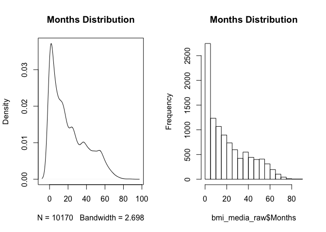
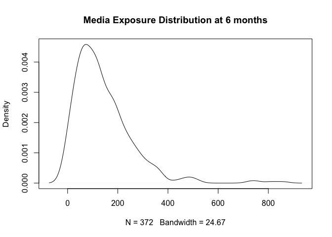
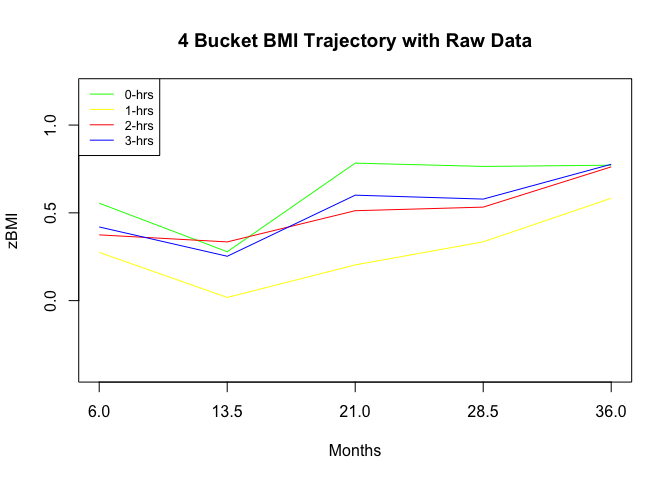

BMI Trajectories
================
Zarni Htet
March 22 2018

### Introduction

The goal of this code file is to visualize trajectories of average **BMI** of subjects over time (from 6 months to 36 months) across quantiles of **Media Exposure** time. The objective is to visually explore how subjects with different initial **Media Exposure** times change in **BMI** over time as well as differences in their *change* in **BMI** over time. The visual exploration will further our understanding of the functional forms behind the scenes.

### Datasets Involved

There are two data sets involved in creating the trajectory visuals. The first one is the raw combined dataset of **BMI** and **Media Exposure** produced from **01a\_Linear\_Interpolation**. The second one is the linear interpolated combined dataset again from **01a\_Linear\_Interpolation**.

### Admnistration

Professor Marc Scott and Professor Daphna Harel are the supervisors of this project. The data is from the Belle Lab at the Bellevue Hospital. Additional background on the project is in the *README* at the root directory of the Github repository associated with the project.

#### R Libraries

This block has all the *required* libraries for this code file.

``` r
library (rio) # For importing data set
library (mi)  # For removing missing data
library (dplyr) # For grouping manipulations
library (reshape) # For converting data to long format
```

#### I: Uploading Raw & Linearly Interpolated Data

``` r
#raw data
bmi_media_raw <- import("../../data/final/final_na_data.csv")
bmi_media_raw <- bmi_media_raw[,-1]
```

``` r
#uploading interpolated data
bmi_media <- import("../../data/final/final_interp_data.csv")
#Use the Custom Function here Later on
bmi_media <- bmi_media[,-1]
```

#### II: Trajectory of zBMI using the raw non-imputed data set

In this section, the BMI trajectory is visualized using the raw non-imputed dataset generated from file **01a\_Linear\_Interpolation** of this project. The trajectory plotting is realized in six steps.

##### Step 1: Initial Data Explorations

A full (outer) join of the BMI and Media Exposure datasets generates the raw dataset. There are 537 subject IDs in this data set.

``` r
print(bmi_media_raw[6:15,])
```

    ##    ID    Months     Media       zBMI
    ## 6   1  6.373717        NA -2.5585830
    ## 7   1  7.786448 235.00001         NA
    ## 8   1 12.813142        NA  1.0119723
    ## 9   1 15.244353 140.00001         NA
    ## 10  2  0.000000        NA  1.2820979
    ## 11  2  1.544148        NA  2.6198270
    ## 12  2  2.529774        NA  1.0224092
    ## 13  2  6.735113  75.00001  1.0519278
    ## 14  2 10.841889        NA  1.9389179
    ## 15  2 11.728952        NA  0.9665915

``` r
#Number of unique subjectIDs
print(length(unique(bmi_media_raw$ID))) #537
```

    ## [1] 537

The month's distribution subject IDs is right-skewed. It indicates that the subjects in the study drop-off as time goes by. This missing data is one of the primary reasons for our methodological exploration/research. For this document, the focus is on time between 6 to 36 months.

``` r
#Checking out the distribution of Months
par(mfrow=c(1,2))
plot(density(bmi_media_raw$Months), main = "Months Distribution")
hist(bmi_media_raw$Months, main = "Months Distribution")
```



##### Step 2: Establishing Time Intervals

The research doctors at the Belle Lab have established six months as the baseline for measuring BMI for subjects involved in the study. Additionally, they have picked 13.5, 21, 28.5 and 36 months as time points for BMI measurements. As can be seen from the distribution above, the time points are not all centered at the above intervals of 13.5, 21, etc. Therefore, with an average range of at least six months between each period, a range of 6 months is chosen with the above listed time points of 13.5, 21, etc at its center.

##### Step 3: Establishing Baseline

An actual baseline of BMI with subject IDs that falls within a six-month interval of BMI measurement at the sixth month must be established first. Then, these same subject IDs will be further binned into quantile of Media Exposure. Afterward, binning the other time points to a six-month interval will be carried out.

``` r
#protecting data integrity of the raw data
baseline <- bmi_media_raw
#creating baseline 6 months interval
baseline[baseline$Months >=3 & baseline$Months <= 9,]$Months <- 6
```

As shown below, after binning the baseline to the sixth month, 17 subject IDs are dropped as they do not have baseline BMI measurements within a six-month interval centered at the six-month time point.

``` r
#Pulling the 6 months dataset out to **categorize** the subjectIDs by their media exposure quantiles.
baseline_6months <- baseline[baseline$Months == 6, ]
#Out of 537 subjectIDs at all time, we lose around 17 subject IDs.
print(length(unique(baseline$ID))- length(unique(baseline_6months$ID))) 
```

    ## [1] 17

To further bin the subject IDs into Media Exposure quantiles, a removal of NA values of Media Exposure at the six-month time point has to be carried out. Only 372 subjects have non-NA values at the six-month time point.

``` r
baseline_6_media_nonNA <- baseline_6months %>% group_by(ID) %>% summarise(non_na_count = sum(!is.na(Media)))
print(sum(baseline_6_media_nonNA$non_na_count)) #460 subjectIDs
```

    ## [1] 372

The number of non-NA Media Exposure subject corresponds to approximately **71.53** percent of the available subject IDs at that time point.

``` r
print((sum(baseline_6_media_nonNA$non_na_count)/nrow(baseline_6_media_nonNA)) * 100)
```

    ## [1] 71.53846

``` r
#Removing the all NA media exposure subject IDs from the baseline data set
baseline_6_media_nonNA <- baseline_6_media_nonNA[baseline_6_media_nonNA$non_na_count ==1, ]
baseline_6months <- baseline_6months %>% inner_join(baseline_6_media_nonNA, by = c("ID" = "ID"))
```

As can be seen below, the Media Exposure times are square transformed. The goal is to use quantiles of the Media to divide it up into 4 categories. Then, those categories will map to 0,1,2,3 hours respectively to follow as closely as possible to the preliminary trajectories visualized by the research doctors at the Belle Lab.

``` r
plot(density(baseline_6months$Media,  na.rm = TRUE),main = "Media Exposure Distribution at 6 months")
```



``` r
#Establishing labels
labels <- c("0hrs", "1hrs", "2hrs", "3hrs")
baseline_6months$MediaCategory <- cut(baseline_6months$Media, breaks = quantile(baseline_6months$Media, na.rm = TRUE), labels = labels, include.lowest = TRUE, right = FALSE) #include.lowest, True to be inclusive of left hand-side and exclusive of right hand side.
```

##### Step 4: Mapping Baseline to Raw Data

To plot the trajectory of the BMI measures for up to 36 months, the 6-month baseline data must be mapped back to the raw data with the appropriate Media Exposure categories.

``` r
baseline_6_media_nonNA <- baseline_6months[!is.na(baseline_6months$MediaCategory),]
#subsetting the data set further to the ID and the Media Category we want to attach to the raw data set
baseline_6_media_nonNA <- baseline_6_media_nonNA[,c("ID", "MediaCategory")]
baseline_cat <- baseline %>% inner_join(baseline_6_media_nonNA, by = c("ID" = "ID"))
#To rearrange it by subjectID and available months
baseline_cat <- baseline_cat %>% arrange(ID, Months) 
```

From the initial 520, there are only 368 subject IDs left that has media exposure which could be binned. 71.5 percent of the data is retained.

``` r
#Current number of subjectIDs for trajectory plotting
print(length(unique(baseline_cat$ID))/520) #368
```

    ## [1] 0.7153846

The next step is to bin the rest of the time points into 6 months interval centered at 13.5, 21, 28.5 and 36 months.

``` r
baseline_cat[baseline_cat$Months >=10.5 & baseline_cat$Months <= 16.5, ]$Months <- 13.5
baseline_cat[baseline_cat$Months >=18 & baseline_cat$Months <= 24, ]$Months <- 21
baseline_cat[baseline_cat$Months >=25.5 & baseline_cat$Months <= 31.5, ]$Months <- 28.5
baseline_cat[baseline_cat$Months >=33 & baseline_cat$Months <= 39, ]$Months <- 36
```

Furthermore, the data is subsetted into those time interval months.

``` r
baseline_cat_months <- dplyr::filter(baseline_cat, Months == 6 | Months == 13.5 | Months == 21 | Months == 28.5 | Months == 36)
print(head(baseline_cat_months))
```

    ##   ID Months     Media      zBMI MediaCategory
    ## 1  1    6.0        NA -1.183701          3hrs
    ## 2  1    6.0        NA -2.558583          3hrs
    ## 3  1    6.0 235.00001        NA          3hrs
    ## 4  1   13.5        NA  1.011972          3hrs
    ## 5  1   13.5 140.00001        NA          3hrs
    ## 6  2    6.0  75.00001  1.051928          1hrs

A quick check of the data size shows that there is zero loss of data after binning the months and subsequent filtering.

``` r
print(length(unique(baseline_cat_months$ID))/length(unique(baseline_cat$ID))) 
```

    ## [1] 1

``` r
#Saving the media exposure categories and year(month) intermediate data set
write.csv(baseline_cat_months, "../../data/Intermediate/baseline_media_months_raw.csv")
```

##### Step 5: Importing Mapped Raw Data Set for matrix calculation

``` r
baseline_cat_months <- import("../../data/Intermediate/baseline_media_months_raw.csv")
```

###### Objective

At each time interval for each media exposure category, what is the average **BMI** value when NAs are removed? The expected output is a 5x4 matrix.

``` r
baseline_media_months_final <- tapply(baseline_cat_months$zBMI, list(baseline_cat_months$Months, baseline_cat_months$MediaCategory), mean, na.rm = TRUE)
print(head(baseline_media_months_final))
```

    ##           0hrs       1hrs      2hrs      3hrs
    ## 6    0.5550487 0.27483255 0.3745449 0.4196311
    ## 13.5 0.2782522 0.01792882 0.3343689 0.2525913
    ## 21   0.7831918 0.20337318 0.5121336 0.6006685
    ## 28.5 0.7643058 0.33490434 0.5326615 0.5783209
    ## 36   0.7714520 0.58317597 0.7619591 0.7765702

``` r
#Saving the Matrix calculated
write.csv(baseline_media_months_final, "../../data/final/baseline_media_months_raw_matrix.csv")
```

##### Step 6: Importing the matrix data set for trajectory plotting

``` r
baseline_media_months <- import("../../data/final/baseline_media_months_raw_matrix.csv")
colnames(baseline_media_months) <- c("Months", "0hrs", "1hrs", "2hrs", "3hrs")
```

###### Plotting the zBMI across 4 Media Exposure categories across time

``` r
plot(baseline_media_months$Mo, baseline_media_months$`0hrs`, type = "l", xaxt = "n", main = "4 Bucket BMI Trajectory with Raw Data", xlab = "Months", ylab = "zBMI", ylim = c(-0.4, 1.2),  col = "green")
axis(1, at = baseline_media_months$Months)
lines(baseline_media_months$Mo,baseline_media_months$`1hrs`, col = "yellow")
lines(baseline_media_months$Mo,baseline_media_months$`2hrs`, col = "red")
lines(baseline_media_months$Mo,baseline_media_months$`3hrs`, col = "blue")
#lines(baseline_media_months$Mo,baseline_media_months$`4hrs`, col = "blue")
legend("topleft", legend = c("0-hrs", "1-hrs" ,"2-hrs", "3-hrs"), col = c("green", "yellow", "red","blue"), lty = 1, cex = 0.8)
```



#### III: Trajectory of zBMI using the linearly interpolated data set

In this section, like the section before zBMI is plotted over multiple time points after being binned into quantiles of Media Exposure categories. Unlike the raw data from before however, the binning of the months will not be a 6-month interval. As the data is linearly interpolated, there are much denser time points with different **zBMI** or **Media** values as can be seen below. Binning the months by a wider time range would lose those exact values and confound actual measures at around the sixth month.

``` r
print(head(bmi_media))
```

    ##   ID    Months    Media       zBMI
    ## 1  1 0.0000000 15.32971 -3.5407891
    ## 2  1 0.1314168 15.32971 -3.1878707
    ## 3  1 0.5585216 15.32971 -0.2831618
    ## 4  1 1.5441478 15.32971 -1.2716171
    ## 5  1 4.3039017 15.32971 -1.1837007
    ## 6  1 6.3737168 15.32971 -2.5585830

##### Step 1: Establishing the Baseline at 6 months

``` r
#The base data set for all the Ids for this Lowess Curve
baseline <- bmi_media[bmi_media$Months >=5.5 & bmi_media$Months <= 6.5,]
```

##### Step 2: Categorizing the subject IDs by Media Exposure tome

``` r
#Establishing labels
labels <- c("0hrs", "1hrs", "2hrs", "3hrs")
baseline$MediaCategory <- cut(baseline$Media, breaks = quantile(baseline$Media, na.rm = TRUE), labels = labels, include.lowest = TRUE, right = FALSE)
#include.lowest, True to be inclusive of left hand-side and exclusive of right hand side.
```

##### Step 3: Mapping the categorized baseline subject IDs back to the main data set

In order to the plot the trajectory of the BMI measures for up to 36 months, the 6 month baseline data must be mapped back to the raw data with the appropriate Media Exposure categories.

``` r
#To pull out only ID and Media Category as those are the only two needed to rejoin the dataset
baseline <- baseline[,c("ID", "MediaCategory")]
baseline_cat_all <- bmi_media %>% inner_join(baseline, by = c("ID" = "ID"))
#To rearrange it by subjectID and available months
baseline_cat_all <- baseline_cat_all %>% arrange(ID, Months) 
```

##### Step 4: Binning the months by 1 month interval at 6, 13.5,21,28.5 and 36

``` r
baseline_cat_all[baseline_cat_all$Months >=5.5 & baseline_cat_all$Months <= 6.5,]$Months <-6
baseline_cat_all[baseline_cat_all$Months >=13  & baseline_cat_all$Months <= 14,]$Months <-13.5
baseline_cat_all[baseline_cat_all$Months >=20.5 & baseline_cat_all$Months <= 21.5,]$Months <-21
baseline_cat_all[baseline_cat_all$Months >=28 & baseline_cat_all$Months <= 29,]$Months <-28.5
baseline_cat_all[baseline_cat_all$Months >=35.5 & baseline_cat_all$Months <= 36.5,]$Months <-36
```

``` r
#Subset the data to only the months centered at 6, 13.5,21, 28.5 and 36
x <- c(6, 13.5,21,28.5, 36)
baseline_cat_all <- baseline_cat_all[baseline_cat_all$Months %in% x,]
```

``` r
#Saving the media exposure categories and year(month) intermediate data set
write.csv(baseline_cat_all, "../../data/Intermediate/baseline_media_months_interpolated.csv")
```

##### Step 5: Importing Mapped Interpolated Data Set for matrix calculation

``` r
baseline_cat_all <- import("../../data/Intermediate/baseline_media_months_interpolated.csv")
```

###### Objective

At each time interval for each media exposure category, what is the average **BMI** value? The expected output is a 5x4 matrix.

``` r
baseline_media_months_final_int <- tapply(baseline_cat_all$zBMI, list(baseline_cat_all$Months, baseline_cat_all$MediaCategory), mean, na.rm = TRUE)
print(head(baseline_media_months_final_int))
```

    ##           0hrs       1hrs      2hrs      3hrs
    ## 6    0.4821746 0.38613960 0.3643823 0.4447418
    ## 13.5 0.4792404 0.01083544 0.4731820 0.4624395
    ## 21   0.7287052 0.09623133 0.5100066 0.6797114
    ## 28.5 0.5416588 0.44416867 0.6606757 0.8197242
    ## 36   0.3650614 0.44892778 0.6969442 1.0004512

``` r
#Saving the Matrix calculated
write.csv(baseline_media_months_final_int, "../../data/final/baseline_media_months_interpolated_matrix.csv")
```

##### Step 6: Importing the matrix data set for trajectory plotting

``` r
baseline_media_months_int <- import("../../data/final/baseline_media_months_interpolated_matrix.csv")
colnames(baseline_media_months_int) <- c("Months", "0hrs", "1hrs", "2hrs", "3hrs")
```

###### Plotting the zBMI across 4 Media Exposure categories across time

``` r
plot(baseline_media_months_int$Months, baseline_media_months_int$`0hrs`, type = "l", xaxt = "n", main = "4 Bucket BMI Trajectory with Interpolated Data", xlab = "Months", ylab = "zBMI", ylim = c(-0.4, 1.2),  col = "green")
axis(1, at = baseline_media_months_int$Months)
lines(baseline_media_months_int$Months,baseline_media_months_int$`1hrs`, col = "yellow")
lines(baseline_media_months_int$Months,baseline_media_months_int$`2hrs`, col = "red")
lines(baseline_media_months_int$Months,baseline_media_months_int$`3hrs`, col = "blue")
legend("topleft", legend = c("0-hrs", "1-hrs" ,"2-hrs", "3-hrs"), col = c("green", "yellow", "red","blue"), lty = 1, cex = 0.8)
```


