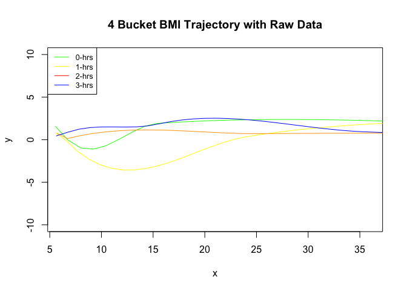

Loess Smoothing
================
Zarni Htet

### Libraries

``` r
require (rio) # For importing data set
```

    ## Loading required package: rio

``` r
require (mi)  # For removing missing data
```

    ## Loading required package: mi

    ## Loading required package: Matrix

    ## Loading required package: stats4

    ## mi (Version 1.0, packaged: 2015-04-16 14:03:10 UTC; goodrich)

    ## mi  Copyright (C) 2008, 2009, 2010, 2011, 2012, 2013, 2014, 2015 Trustees of Columbia University

    ## This program comes with ABSOLUTELY NO WARRANTY.

    ## This is free software, and you are welcome to redistribute it

    ## under the General Public License version 2 or later.

    ## Execute RShowDoc('COPYING') for details.

### Importing Data

``` r
#interpolated data
bmi_media <- import("../../data/final/final_interp_data.csv")
bmi_media <- bmi_media[,-1]
print(sum(is.na(bmi_media)))
```

    ## [1] 0

``` r
print(dim(bmi_media))
```

    ## [1] 10170     4

``` r
#raw data
bmi_media_raw <- import("../../data/final/final_na_data.csv")
bmi_media_raw <- bmi_media_raw[,-1]
print(dim(bmi_media_raw))
```

    ## [1] 10170     4

``` r
print(dim(bmi_media_raw[complete.cases(bmi_media_raw),]))
```

    ## [1] 332   4

Removing the missing values in bmi\_media raw

``` r
#na.omit ?
#complete.cases ?
bmi_media_raw_nna <- bmi_media_raw[complete.cases(bmi_media_raw),]
```

### Trajectory for Linearly Interpolated Data Set

#### 1: LOESS application of 1 month interval at each time cut point

The goal here is to bin media usage to 5 categories (0 hrs, 1 hrs, 2
hrs, 3 hrs and 4 hrs) starting from a baseline of 6 months. Then, we
will follow the trajectory for these *same* subjectIDs for 13.5 months,
21 months, 28.5 months and 36 months.

**The Time Conversion**

#### Question to Marc/Daphna

*Do you want me to exponentiate? It would blow up the current range of
Hrs we have from 0-7. The Log would bring in negative values.*

We are subsetting the data set to only include the SubjectIDs that have
media exposure at about 1 month interval centering at 6 months.

``` r
#The base data set for all the Ids for this Lowess Curve
base <- bmi_media[bmi_media$Months >=5.5 & bmi_media$Months <= 6.5,]
sum(is.na(base))
```

    ## [1] 0

``` r
#The distribution of the cut off points for media usage
print(quantile(base$Media))
```

    ##       0%      25%      50%      75%     100% 
    ## 0.000000 4.110874 4.795791 5.198497 6.532418

``` r
#The distribution of cut off points for time for the same Subject IDs
base_alltime <- bmi_media[bmi_media$ID %in% base$ID,]
print(sum(is.na(base_alltime)))
```

    ## [1] 0

``` r
#Quantile breaks for Media Exposure
print(table(cut(base_alltime$Media, breaks = quantile(base_alltime$Media))))
```

    ## 
    ##    (0,4.11] (4.11,4.76]  (4.76,5.2]   (5.2,6.7] 
    ##        1798        1455        1869        1576

``` r
#the Cut command returns a vector where each entry has a factor indicator of what quantile it belongs to 
#datasub <- cut(base_alltime$Media, breaks = quantile(base_alltime$Media), include.lowest = TRUE)
```

Binning the months by interval of a month to desired integers of 6,
13.5, 21, 28.5,
36

``` r
base_alltime[base_alltime$Months >=5.5 & base_alltime$Months <= 6.5,]$Months <-6
base_alltime[base_alltime$Months >=13 & base_alltime$Months <= 14,]$Months <-13.5
base_alltime[base_alltime$Months >=20.5 & base_alltime$Months <= 21.5,]$Months <-21
base_alltime[base_alltime$Months >=28 & base_alltime$Months <= 29,]$Months <-28.5
base_alltime[base_alltime$Months >=35.5 & base_alltime$Months <= 36.5,]$Months <-36
```

Subsetting the data set of those months only

``` r
x <- c(6, 13.5, 21, 28.5, 36) # Months Vector for subsetting data
base_alltime <- base_alltime[base_alltime$Months %in% x,]
```

Divide the IDs into 4 categories based on the media usage quantiles
above starting at a baseline of 6 months

``` r
#6 months base IDs
base_6 <- base_alltime[base_alltime$Months %in% c(6),]
base6_l1 <- base_6[base_6$Media >=0 & base_6$Media <4.11, ]
base6_l2 <- base_6[base_6$Media >=4.11 & base_6$Media <4.76, ]
base6_l3 <- base_6[base_6$Media >=4.76 & base_6$Media <5.2, ]
base6_l4 <- base_6[base_6$Media >=5.2 & base_6$Media <6.7, ]
```

``` r
#Getting the same baseline level IDs for Trajectories across the months
base_l1 <- base_alltime[base_alltime$ID %in% base6_l1$ID,]
base_l2 <- base_alltime[base_alltime$ID %in% base6_l2$ID,]
base_l3 <- base_alltime[base_alltime$ID %in% base6_l3$ID,]
base_l4 <- base_alltime[base_alltime$ID %in% base6_l4$ID,]

#print(base_l1)

x<- c(6, 13.5, 21, 28.5, 36)
y<- c(-4.86, -0.39, 0.40, 1.18, 4.98)

plot(x, y, type = "n", main = "4 Bucket BMI Trajectory with Interpolated Data", ylim = c(0,2))
lines(loess.smooth(x = base_l1$Months, y = base_l1$zBMI), col = "green")
lines(loess.smooth(x = base_l2$Months, y = base_l2$zBMI), col = "yellow")
lines(loess.smooth(x = base_l3$Months, y = base_l3$zBMI), col = "orange")
lines(loess.smooth(x = base_l4$Months, y = base_l4$zBMI), col = "blue")
legend("topleft", legend = c("0-hrs", "1-hrs", "2-hrs", "3-hrs"), col = c("green", "yellow", "red","blue"), lty = 1, cex = 0.8)
```

<!-- -->

### Trajectory for Raw Data

#### 1: LOESS application of across all time periods with base at 6 months

``` r
#The base data set for all the Ids for this Lowess Curve
base_6_raw <- bmi_media_raw_nna[bmi_media_raw_nna$Months >=5.5 & bmi_media_raw_nna$Months <= 6.5,]
#The distribution of the cut off points for media usage
print(quantile(base_6_raw$Media))
```

    ##       0%      25%      50%      75%     100% 
    ## 0.000000 4.110874 4.795791 5.303305 6.236370

``` r
#The distribution of cut off points for time for the same Subject IDs
base_alltime_raw <- bmi_media_raw_nna[bmi_media_raw_nna$ID %in% base_6_raw$ID,]
print(sum(is.na(base_alltime_raw)))
```

    ## [1] 0

``` r
#Quantile breaks for Media Exposure
table(cut(base_alltime_raw$Media, breaks = quantile(base_alltime_raw$Media)))
```

    ## 
    ##    (0,4.11]  (4.11,4.8]  (4.8,5.28] (5.28,6.24] 
    ##          41          45          32          43

``` r
#the Cut command returns a vector where each entry has a factor indicator of what quantile it belongs to 
#datasub <- cut(base_alltime$Media, breaks = quantile(base_alltime$Media), include.lowest = TRUE)
```

``` r
#Getting the Loess data points
base6_l1_raw <- base_6_raw[base_6_raw$Media >=0 & base_6_raw$Media <4.11, ]
base6_l2_raw <- base_6_raw[base_6_raw$Media >=4.11 & base_6_raw$Media <4.79, ]
base6_l3_raw <- base_6_raw[base_6_raw$Media >=4.79 & base_6_raw$Media <5.30, ]
base6_l4_raw <- base_6_raw[base_6_raw$Media >=5.30 & base_6_raw$Media <6.24, ]
```

``` r
#Getting the same baseline level IDs for Trajectories across the months
base_l1_raw <- base_alltime_raw[base_alltime_raw$ID %in% base6_l1_raw$ID,] #everything is at 6 months
base_l2_raw <- base_alltime_raw[base_alltime_raw$ID %in% base6_l2_raw$ID,]
base_l3_raw <- base_alltime_raw[base_alltime_raw$ID %in% base6_l3_raw$ID,]
base_l4_raw <- base_alltime_raw[base_alltime_raw$ID %in% base6_l4_raw$ID,]
```

``` r
x<- c(6, 13.5, 21, 28.5, 36)
y<- c(-4.86, -0.39, 0.40, 1.18, 4.98)

plot(x, y, type = "n", main = "4 Bucket BMI Trajectory with Raw Data", ylim = c(-10,10))
lines(loess.smooth(x = base_l1_raw$Months, y = base_l1_raw$zBMI), col = "green")
lines(loess.smooth(x = base_l2_raw$Months, y = base_l2_raw$zBMI), col = "yellow")
lines(loess.smooth(x = base_l3_raw$Months, y = base_l3_raw$zBMI), col = "orange")
lines(loess.smooth(x = base_l4_raw$Months, y = base_l4_raw$zBMI), col = "blue")
legend("topleft", legend = c("0-hrs", "1-hrs", "2-hrs", "3-hrs"), col = c("green", "yellow", "red","blue"), lty = 1, cex = 0.8)
```

<!-- -->

### Diagonosis

``` r
min(base_l2_raw$zBMI)
```

    ## [1] -2.44301

``` r
max(base_l1_raw$zBMI)
```

    ## [1] 2.560652

``` r
base_l3_raw$zBMI
```

    ##  [1]  0.47749943 -1.01137006  1.80191541  0.77875960 -2.29538751
    ##  [6]  1.31483471  0.06800344  0.86604887  0.46463537  0.87980497
    ## [11]  0.34281746  1.45697749  0.49215683 -0.43503496 -0.43459883
    ## [16]  0.53000855  0.52317739 -0.18803692  1.69294882  0.89458406
    ## [21]  1.56407177 -1.73121345  0.43533859 -1.18708360  0.51481140
    ## [26] -0.04959480  0.29350385  0.03604599  0.25564852  1.76937735
    ## [31]  2.47307730  1.41329014  0.93886971 -0.85266197  0.02901554
    ## [36] -0.67690217  0.23038980  0.15325515 -0.67194170 -1.35346448
    ## [41] -1.20007193  0.34975472 -0.66338742  3.91258550  3.53164148
    ## [46]  0.53706098 -0.12000490  0.51902181

<!-- ## IGNORE CODE BELOW -->

<!-- #### 2: LOESS application of 1 month interval at each time cut point with base at 6 months -->

<!-- The goal here is to bin media usage to 5 categories (0 hrs, 1 hrs, 2 hrs, 3 hrs and 4 hrs) starting from a baseline of 6 months. Then, we will follow the same trajectory for these *same* subjectIDs for 13.5 months, 21 months, 28.5 months and 36 months. -->

<!-- **The Time Conversion** -->

<!-- #### Question to Marc -->

<!-- *Do you want me to exponetiate? It would blow up the current range of Hrs we have from 0-7. -->

<!-- The Log would bring in negative values.* -->

<!-- ```{r} -->

<!-- ``` -->

<!-- We are subsetting the data set to only include the SubjectIDs that have media exposure at about 1 month interval -->

<!-- centering at 6 months. -->

<!-- ```{r} -->

<!-- #The base data set for all the Ids for this Lowess Curve -->

<!-- base_raw <- bmi_media_raw_nna[bmi_media_raw_nna$Months >=5.5 & bmi_media_raw_nna$Months <= 6.5,] -->

<!-- #The distribution of the cut off points for media usage -->

<!-- print(quantile(base_raw$Media)) -->

<!-- ``` -->

<!-- ```{r} -->

<!-- #The distribution of cut off points for time for the same Subject IDs -->

<!-- base_alltime_raw <- bmi_media_raw_nna[bmi_media_raw_nna$ID %in% base_raw$ID,] -->

<!-- print(sum(is.na(base_alltime_raw))) -->

<!-- #Quantile breaks for Media Exposure -->

<!-- table(cut(base_alltime_raw$Media, breaks = quantile(base_alltime_raw$Media))) -->

<!-- #the Cut command returns a vector where each entry has a factor indicator of what quantile it belongs to  -->

<!-- #datasub <- cut(base_alltime$Media, breaks = quantile(base_alltime$Media), include.lowest = TRUE) -->

<!-- ``` -->

<!-- Binning the months by interval of a month to desired integers of 6, 13.5, 21, 28.5, 36 -->

<!-- ```{r} -->

<!-- base_alltime_raw[base_alltime_raw$Months >=5.5 & base_alltime_raw$Months <= 6.5,]$Months <-6 -->

<!-- base_alltime_raw[base_alltime_raw$Months >=13 & base_alltime_raw$Months <= 14,]$Months <-13.5 -->

<!-- #Data interval has to be widened for the month centered around 21 to 3 month interval -->

<!-- base_alltime_raw[base_alltime_raw$Months >=18.5 & base_alltime_raw$Months <= 23.5,]$Months <-21 -->

<!-- base_alltime_raw[base_alltime_raw$Months >=28 & base_alltime_raw$Months <= 29,]$Months <-28.5 -->

<!-- base_alltime_raw[base_alltime_raw$Months >=35.5 & base_alltime_raw$Months <= 36.5,]$Months <-36 -->

<!-- ``` -->

<!-- Subsetting the data set of those months only -->

<!-- ```{r} -->

<!-- x <- c(6, 13.5, 21, 28.5, 36) # Months Vector for subsetting data -->

<!-- base_alltime_raw <- base_alltime_raw[base_alltime_raw$Months %in% x,] -->

<!-- ``` -->

<!-- Divide the IDs into 4 categories based on Media usage quantile above starting at base like of 6 months. -->

<!-- The quantile cuts in raw data are **different** from the quantile cuts of interpolated data which is to be expected.  -->

<!-- ```{r} -->

<!-- #6 months base IDs -->

<!-- base_6_raw <- base_alltime_raw[base_alltime_raw$Months %in% c(6),] -->

<!-- base6_l1_raw <- base_6_raw[base_6_raw$Media >=0 & base_6_raw$Media <4.11, ] -->

<!-- base6_l2_raw <- base_6_raw[base_6_raw$Media >=4.11 & base_6_raw$Media <4.8, ] -->

<!-- base6_l3_raw <- base_6_raw[base_6_raw$Media >=4.8 & base_6_raw$Media <5.28, ] -->

<!-- base6_l4_raw <- base_6_raw[base_6_raw$Media >=5.28 & base_6_raw$Media <6.24, ] -->

<!-- ``` -->

<!-- ```{r} -->

<!-- #Getting the same baseline level IDs for Trajectories across the months -->

<!-- base_l1_raw <- base_alltime_raw[base_alltime_raw$ID %in% base6_l1_raw$ID,] -->

<!-- base_l2_raw <- base_alltime_raw[base_alltime_raw$ID %in% base6_l2_raw$ID,] -->

<!-- base_l3_raw <- base_alltime_raw[base_alltime_raw$ID %in% base6_l3_raw$ID,] -->

<!-- base_l4_raw <- base_alltime_raw[base_alltime_raw$ID %in% base6_l4_raw$ID,] -->

<!-- x<- c(6, 13.5, 21, 28.5, 36) -->

<!-- y<- c(-4.86, -0.39, 0.40, 1.18, 4.98) -->

<!-- plot(x, y, type = "n", main = "4 Bucket BMI Trajectory with Raw Data", ylim = c(-1.0,10.0)) -->

<!-- lines(loess.smooth(x = base_l1_raw$Months, y = base_l1_raw$zBMI), col = "green") -->

<!-- lines(loess.smooth(x = base_l2_raw$Months, y = base_l2_raw$zBMI), col = "yellow") -->

<!-- lines(loess.smooth(x = base_l3_raw$Months, y = base_l3_raw$zBMI), col = "orange") -->

<!-- lines(loess.smooth(x = base_l4_raw$Months, y = base_l4_raw$zBMI), col = "blue") -->

<!-- legend("topleft", legend = c("0-hrs", "1-hrs", "2-hrs", "3-hrs"), col = c("green", "yellow", "red","blue"), lty = 1, cex = 0.8) -->

<!-- ``` -->
