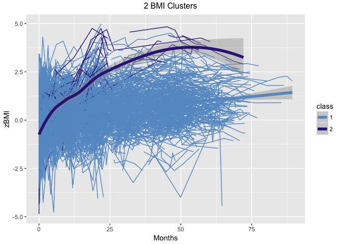
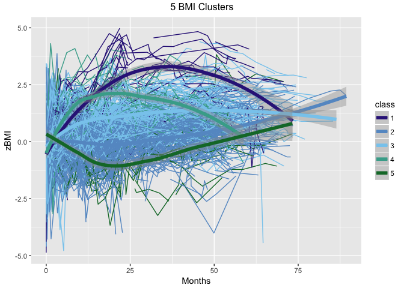

05\_Nagin\_Clusters
================
Zarni Htet
April 11, 2018

### Introduction

The goal of this code file to use a model based clustering method (Nagin clustering) that allows for longitudinal data to figure out underlying groups of subjects in BMI and Media respectively.

### Datasets Involved

The non-imputed dataset filled with NAs from *01a\_Linear\_Interpolation* is used here. Nagin clustering can handle unbalanced design.

### Admnistration

Professor Marc Scott and Professor Daphna Harel are the supervisors of this project. The data is from the Belle Lab at the Bellevue Hospital. Additional background on the project is in the *README* at the root directory of the Github repository associated with the project.

#### R Libraries

This block has all the *required* libraries for this code file.

``` r
library(rio) #For importing datasets
library(lcmm) #For nagin clustering
library(ggplot2) # For visualization
library(gridExtra) #For arranging grids for visualization
library(dplyr) #For joining datasets
```

#### Importing dataset

``` r
#uploading raw data
bmi_media_na <- import("../../data/final/final_na_data.csv")
```

### Clustering

#### Linear Term and Random Intercept for BMI

In the section below, BMI data is clustered initially with a random intercept and linear term. The number clusters that are considered are 2,3,4,5. BIC is used to identify the optimal cluster. Afterwards, the BMI values of each subject is smoothened and plotted by the optimal cluster grouping.

##### 2 Clusters for BMI

``` r
bmilinear2 <- lcmm(zBMI ~ Months, random = ~Months, subject = "ID", mixture = ~Months, ng = 2, data = bmi_media_na)
```

    ## Be patient, lcmm is running ... 
    ## The program took 20.45 seconds

``` r
print(summary(bmilinear2))
```

    ## General latent class mixed model 
    ##      fitted by maximum likelihood method 
    ##  
    ## lcmm(fixed = zBMI ~ Months, mixture = ~Months, random = ~Months, 
    ##     subject = "ID", ng = 2, data = bmi_media_na)
    ##  
    ## Statistical Model: 
    ##      Dataset: bmi_media_na 
    ##      Number of subjects: 537 
    ##      Number of observations: 8879 
    ##      Number of observations deleted: 1291 
    ##      Number of latent classes: 2 
    ##      Number of parameters: 9  
    ##      Link function: linear  
    ##  
    ## Iteration process: 
    ##      Convergence criteria satisfied 
    ##      Number of iterations:  19 
    ##      Convergence criteria: parameters= 1.6e-07 
    ##                          : likelihood= 1e-06 
    ##                          : second derivatives= 1e-13 
    ##  
    ## Goodness-of-fit statistics: 
    ##      maximum log-likelihood: -11135.37  
    ##      AIC: 22288.73  
    ##      BIC: 22327.31  
    ##  
    ##  
    ## Maximum Likelihood Estimates: 
    ##  
    ## Fixed effects in the class-membership model:
    ## (the class of reference is the last class) 
    ## 
    ##                      coef      Se    Wald p-value
    ## intercept class1  2.87860 0.31914   9.020 0.00000
    ## 
    ## Fixed effects in the longitudinal model:
    ## 
    ##                                      coef      Se    Wald p-value
    ## intercept class1 (not estimated)        0                        
    ## intercept class2                 -0.27021 0.26164  -1.033 0.30173
    ## Months class1                     0.02094 0.00144  14.523 0.00000
    ## Months class2                     0.11966 0.01487   8.045 0.00000
    ## 
    ## 
    ## Variance-covariance matrix of the random-effects:
    ##           intercept  Months
    ## intercept   0.84303        
    ## Months     -0.00136 0.00045
    ## 
    ## Residual standard error (not estimated) = 1
    ## 
    ## Parameters of the link function:
    ## 
    ##                          coef      Se    Wald p-value
    ## Linear 1 (intercept)  0.08671 0.03376   2.568 0.01022
    ## Linear 2 (std err)    0.75386 0.00604 124.786 0.00000
    ## 
    ##                                      coef      Se   Wald p-value
    ## intercept class1 (not estimated)  0.00000      NA     NA      NA
    ## intercept class2                 -0.27021 0.26164 -1.033 0.30173
    ## Months class1                     0.02094 0.00144 14.523 0.00000
    ## Months class2                     0.11966 0.01487  8.045 0.00000

##### 3 Clusters for BMI

``` r
bmilinear3 <- lcmm(zBMI ~ Months, random = ~Months, subject = "ID", mixture = ~Months, ng = 3, data = bmi_media_na)
print(summary(bmilinear3))
```

##### 4 Clusters for BMI

``` r
bmilinear4 <- lcmm(zBMI ~ Months, random = ~Months, subject = "ID", mixture = ~Months, ng = 4, data = bmi_media_na)
print(summary(bmilinear4))
```

##### 5 Clusters for BMI

``` r
bmilinear5 <- lcmm(zBMI ~ Months, random = ~Months, subject = "ID", mixture = ~Months, ng = 5, data = bmi_media_na)
print(summary(bmilinear5))
```

#### Picking the Optimal Cluster

``` r
size <- which.min(c(bmilinear2$BIC, bmilinear3$BIC, bmilinear4$BIC, bmilinear5$BIC))
opt.size <- size + 1
print(opt.size)
```

##### BIC value

``` r
print(bmilinear2_bic <- bmilinear2$BIC)
```

    ## [1] 22327.31

##### Grabbing the Clustering Classes

``` r
#the first two columns are ID and class
bmiclass <- bmilinear2$pprob[,c(1:2)] 
#Joining the class back to the raw dataset
bmi_media_na_class_lin <- bmi_media_na %>% left_join(bmiclass, by = c("ID", "ID"))
bmi_media_na_class_lin$class <- as.factor(bmi_media_na_class_lin$class)
```

##### Plotting Subjects by Clusters

``` r
p1 <- ggplot(bmi_media_na_class_lin, aes(Months, zBMI, group = ID, colour = class)) +
      geom_line() + 
      geom_smooth(aes(group = class), method = "loess", size = 2, se = T) + scale_color_manual(values = c("#6699CC","#332288"))
      labs(x = "Months", y = "zBMI", colour = "2 BMI Clusters", title = "Raw Individuals with Smooth Group" )
```

    ## $x
    ## [1] "Months"
    ## 
    ## $y
    ## [1] "zBMI"
    ## 
    ## $colour
    ## [1] "2 BMI Clusters"
    ## 
    ## $title
    ## [1] "Raw Individuals with Smooth Group"
    ## 
    ## attr(,"class")
    ## [1] "labels"

``` r
grid.arrange(p1, ncol = 1, top = "2 BMI Clusters")
```

    ## Warning: Removed 1291 rows containing non-finite values (stat_smooth).

    ## Warning: Removed 330 rows containing missing values (geom_path).



#### Quadratic Term and Random Intercept for BMI

In the section below, BMI data is clustered initially with a random intercept and quadratic term. The number clusters that are considered are 2,3,4,5. BIC is used to identify the optimal cluster. Afterwards, the BMI values of each subject is smoothened and plotted by the optimal cluster grouping.

##### 2 Clusters for BMI

``` r
bmiquadratic2 <- lcmm(zBMI ~ Months + I(Months^2), random = ~Months, subject = "ID", mixture = ~Months + I(Months^2), ng = 2, data = bmi_media_na)
print(summary(bmiquadratic2))
```

##### 3 Clusters for BMI

``` r
bmiquadratic3 <- lcmm(zBMI ~ Months + I(Months^2), random = ~Months, subject = "ID", mixture = ~Months + I(Months^2), ng = 3, data = bmi_media_na)
print(summary(bmiquadratic3))
```

##### 4 Clusters for BMI

``` r
bmiquadratic4 <- lcmm(zBMI ~ Months + I(Months^2), random = ~Months, subject = "ID", mixture = ~Months + I(Months^2), ng = 4, data = bmi_media_na)
print(summary(bmiquadratic4))
```

##### 5 Clusters for BMI

``` r
bmiquadratic5 <- lcmm(zBMI ~ Months + I(Months^2), random = ~Months, subject = "ID", mixture = ~Months + I(Months^2), ng = 5, data = bmi_media_na)
```

    ## Be patient, lcmm is running ... 
    ## The program took 228.67 seconds

``` r
print(summary(bmiquadratic5))
```

    ## General latent class mixed model 
    ##      fitted by maximum likelihood method 
    ##  
    ## lcmm(fixed = zBMI ~ Months + I(Months^2), mixture = ~Months + 
    ##     I(Months^2), random = ~Months, subject = "ID", ng = 5, data = bmi_media_na)
    ##  
    ## Statistical Model: 
    ##      Dataset: bmi_media_na 
    ##      Number of subjects: 537 
    ##      Number of observations: 8879 
    ##      Number of observations deleted: 1291 
    ##      Number of latent classes: 5 
    ##      Number of parameters: 23  
    ##      Link function: linear  
    ##  
    ## Iteration process: 
    ##      Convergence criteria satisfied 
    ##      Number of iterations:  33 
    ##      Convergence criteria: parameters= 5.5e-07 
    ##                          : likelihood= 2.7e-07 
    ##                          : second derivatives= 1.6e-10 
    ##  
    ## Goodness-of-fit statistics: 
    ##      maximum log-likelihood: -10702.5  
    ##      AIC: 21451.01  
    ##      BIC: 21549.59  
    ##  
    ##  
    ## Maximum Likelihood Estimates: 
    ##  
    ## Fixed effects in the class-membership model:
    ## (the class of reference is the last class) 
    ## 
    ##                      coef      Se    Wald p-value
    ## intercept class1 -0.23158 0.65104  -0.356 0.72205
    ## intercept class2  1.88450 0.64562   2.919 0.00351
    ## intercept class3  1.61803 0.63514   2.547 0.01085
    ## intercept class4 -0.09395 0.65535  -0.143 0.88601
    ## 
    ## Fixed effects in the longitudinal model:
    ## 
    ##                                      coef      Se    Wald p-value
    ## intercept class1 (not estimated)        0                        
    ## intercept class2                  0.45218 0.25467   1.776 0.07582
    ## intercept class3                  0.42322 0.26583   1.592 0.11137
    ## intercept class4                  0.37701 0.37276   1.011 0.31183
    ## intercept class5                  0.65559 0.39081   1.678 0.09344
    ## Months class1                     0.26381 0.01338  19.720 0.00000
    ## Months class2                     0.00024 0.00752   0.032 0.97425
    ## Months class3                     0.10006 0.00649  15.423 0.00000
    ## Months class4                     0.21908 0.01609  13.619 0.00000
    ## Months class5                    -0.08303 0.02226  -3.730 0.00019
    ## I(Months^2) class1               -0.00324 0.00022 -14.824 0.00000
    ## I(Months^2) class2                0.00025 0.00012   2.132 0.03299
    ## I(Months^2) class3               -0.00120 0.00009 -12.790 0.00000
    ## I(Months^2) class4               -0.00390 0.00031 -12.421 0.00000
    ## I(Months^2) class5                0.00151 0.00031   4.880 0.00000
    ## 
    ## 
    ## Variance-covariance matrix of the random-effects:
    ##           intercept  Months
    ## intercept   0.90158        
    ## Months     -0.00706 0.00038
    ## 
    ## Residual standard error (not estimated) = 1
    ## 
    ## Parameters of the link function:
    ## 
    ##                          coef      Se    Wald p-value
    ## Linear 1 (intercept) -0.33124 0.16747  -1.978 0.04795
    ## Linear 2 (std err)    0.69826 0.00571 122.369 0.00000
    ## 
    ##                                      coef      Se    Wald p-value
    ## intercept class1 (not estimated)  0.00000      NA      NA      NA
    ## intercept class2                  0.45218 0.25467   1.776 0.07582
    ## intercept class3                  0.42322 0.26583   1.592 0.11137
    ## intercept class4                  0.37701 0.37276   1.011 0.31183
    ## intercept class5                  0.65559 0.39081   1.678 0.09344
    ## Months class1                     0.26381 0.01338  19.720 0.00000
    ## Months class2                     0.00024 0.00752   0.032 0.97425
    ## Months class3                     0.10006 0.00649  15.423 0.00000
    ## Months class4                     0.21908 0.01609  13.619 0.00000
    ## Months class5                    -0.08303 0.02226  -3.730 0.00019
    ## I(Months^2) class1               -0.00324 0.00022 -14.824 0.00000
    ## I(Months^2) class2                0.00025 0.00012   2.132 0.03299
    ## I(Months^2) class3               -0.00120 0.00009 -12.790 0.00000
    ## I(Months^2) class4               -0.00390 0.00031 -12.421 0.00000
    ## I(Months^2) class5                0.00151 0.00031   4.880 0.00000

#### Picking the Optimal Cluster

``` r
size <- which.min(c(bmiquadratic2$BIC, bmiquadratic3$BIC, bmiquadratic4$BIC, bmiquadratic5$BIC))
opt.size <- size + 1
print(opt.size)
```

##### BIC value

``` r
print(bmiquadratic5_bic <- bmiquadratic5$BIC)
```

    ## [1] 21549.59

##### Grabbing the Clustering Classes

``` r
#the first two columns are ID and class
bmiclass <- bmiquadratic5$pprob[,c(1:2)] 
#Joining the class back to the raw dataset
bmi_media_na_class_quad <- bmi_media_na %>% left_join(bmiclass, by = c("ID", "ID"))
bmi_media_na_class_quad$class <- as.factor(bmi_media_na_class_quad$class)
```

##### Plotting Subjects by Clusters

``` r
p1 <- ggplot(bmi_media_na_class_quad, aes(Months, zBMI, group = ID, colour = class)) +
      geom_line() + 
      geom_smooth(aes(group = class), method = "loess", size = 2, se = T) + scale_color_manual(values = c("#332288", "#6699CC", "#88CCEE", "#44AA99", "#117733"))
      labs(x = "Months", y = "zBMI", colour = "5 BMI Clusters", title = "Raw Individuals with Smooth Group" )
```

    ## $x
    ## [1] "Months"
    ## 
    ## $y
    ## [1] "zBMI"
    ## 
    ## $colour
    ## [1] "5 BMI Clusters"
    ## 
    ## $title
    ## [1] "Raw Individuals with Smooth Group"
    ## 
    ## attr(,"class")
    ## [1] "labels"

``` r
grid.arrange(p1, ncol = 1, top = "5 BMI Clusters")
```

    ## Warning: Removed 1291 rows containing non-finite values (stat_smooth).

    ## Warning: Removed 330 rows containing missing values (geom_path).


