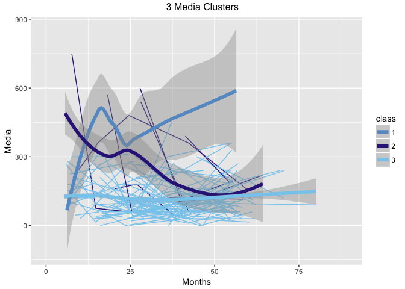
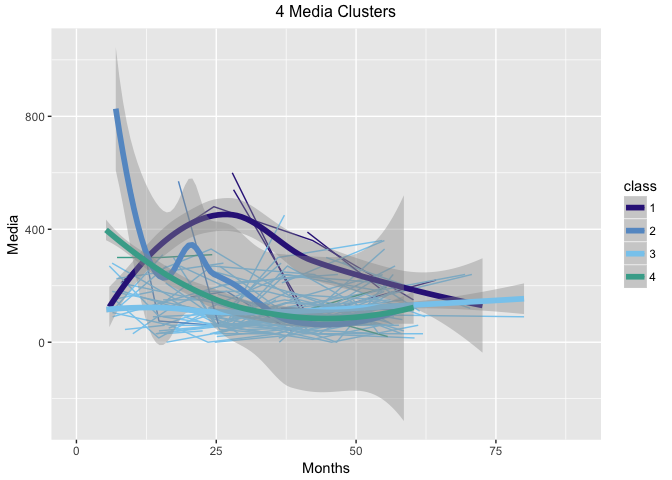

05b\_Nagin\_Clusters\_Media
================
Zarni Htet
April 11, 2018

### Introduction

The goal of this code file to use a model based clustering method (Nagin clustering) that allows for longitudinal data to figure out underlying groups of subjects in Media.

### Datasets Involved

The non-imputed dataset filled with NAs from *01a\_Linear\_Interpolation* is used here. Nagin clustering can handle unbalanced design.

### Admnistration

Professor Marc Scott and Professor Daphna Harel are the supervisors of this project. The data is from the Belle Lab at the Bellevue Hospital. Additional background on the project is in the *README* at the root directory of the Github repository associated with the project.

#### R Libraries

This block has all the *required* libraries for this code file.

``` r
library(rio) #For importing datasets
library(lcmm) #For nagin clustering
library(ggplot2) # For visualization
library(gridExtra) #For arranging grids for visualization
library(dplyr) #For joining datasets
```

#### Importing dataset

``` r
#uploading raw data
bmi_media_na <- import("../../data/final/final_na_data.csv")
```

### Clustering

#### Linear Term and Random Intercept for Media

In the section below, Media data is clustered initially with a random intercept and linear term. The number clusters that are considered are 2,3,4,5. BIC is used to identify the optimal cluster. Afterwards, the Media values of each subject is smoothened and plotted by the optimal cluster grouping.

##### 2 Clusters for Media

``` r
medialinear2 <- lcmm(Media ~ Months, random = ~Months, subject = "ID", mixture = ~Months, ng = 2, data = bmi_media_na)
print(summary(medialinear2))
```

##### 3 Clusters for Media

``` r
medialinear3 <- lcmm(Media ~ Months, random = ~Months, subject = "ID", mixture = ~Months, ng = 3, data = bmi_media_na)
```

    ## Be patient, lcmm is running ... 
    ## The program took 4.63 seconds

``` r
print(summary(medialinear3))
```

    ## General latent class mixed model 
    ##      fitted by maximum likelihood method 
    ##  
    ## lcmm(fixed = Media ~ Months, mixture = ~Months, random = ~Months, 
    ##     subject = "ID", ng = 3, data = bmi_media_na)
    ##  
    ## Statistical Model: 
    ##      Dataset: bmi_media_na 
    ##      Number of subjects: 537 
    ##      Number of observations: 1623 
    ##      Number of observations deleted: 8547 
    ##      Number of latent classes: 3 
    ##      Number of parameters: 12  
    ##      Link function: linear  
    ##  
    ## Iteration process: 
    ##      Convergence criteria satisfied 
    ##      Number of iterations:  36 
    ##      Convergence criteria: parameters= 3.8e-07 
    ##                          : likelihood= 5.1e-10 
    ##                          : second derivatives= 2.1e-12 
    ##  
    ## Goodness-of-fit statistics: 
    ##      maximum log-likelihood: -9765.34  
    ##      AIC: 19554.68  
    ##      BIC: 19606.11  
    ##  
    ##  
    ## Maximum Likelihood Estimates: 
    ##  
    ## Fixed effects in the class-membership model:
    ## (the class of reference is the last class) 
    ## 
    ##                       coef       Se   Wald p-value
    ## intercept class1  -4.37983  0.51733 -8.466 0.00000
    ## intercept class2  -2.90126  0.34064 -8.517 0.00000
    ## 
    ## Fixed effects in the longitudinal model:
    ## 
    ##                                       coef       Se   Wald p-value
    ## intercept class1 (not estimated)         0                        
    ## intercept class2                   3.03527  0.72456  4.189 0.00003
    ## intercept class3                  -0.75534  0.58767 -1.285 0.19868
    ## Months class1                      0.09247  0.02132  4.337 0.00001
    ## Months class2                     -0.07323  0.01250 -5.857 0.00000
    ## Months class3                     -0.00068  0.00166 -0.413 0.67994
    ## 
    ## 
    ## Variance-covariance matrix of the random-effects:
    ##           intercept Months
    ## intercept   0.25687       
    ## Months     -0.00106      0
    ## 
    ## Residual standard error (not estimated) = 1
    ## 
    ## Parameters of the link function:
    ## 
    ##                           coef       Se   Wald p-value
    ## Linear 1 (intercept) 190.89717 50.64997  3.769 0.00016
    ## Linear 2 (std err)    86.28562  1.87134 46.109 0.00000
    ## 
    ##                                      coef      Se   Wald p-value
    ## intercept class1 (not estimated)  0.00000      NA     NA      NA
    ## intercept class2                  3.03527 0.72456  4.189 0.00003
    ## intercept class3                 -0.75534 0.58767 -1.285 0.19868
    ## Months class1                     0.09247 0.02132  4.337 0.00001
    ## Months class2                    -0.07323 0.01250 -5.857 0.00000
    ## Months class3                    -0.00068 0.00166 -0.413 0.67994

##### 4 Clusters for Media

``` r
medialinear4 <- lcmm(Media ~ Months, random = ~Months, subject = "ID", mixture = ~Months, ng = 4, data = bmi_media_na)
print(summary(medialinear4))
```

##### 5 Clusters for Media

``` r
medialinear5 <- lcmm(Media ~ Months, random = ~Months, subject = "ID", mixture = ~Months, ng = 5, data = bmi_media_na)
print(summary(medialinear5))
```

#### Picking the Optimal Cluster

``` r
size <- which.min(c(medialinear2$BIC, medialinear3$BIC, medialinear4$BIC, medialinear5$BIC))
opt.size <- size + 1
print(opt.size)
```

##### BIC value

``` r
print(medialinear3_bic <- medialinear3$BIC)
```

    ## [1] 19606.11

##### Grabbing the Clustering Classes

``` r
#the first two columns are ID and class
mediaclass <- medialinear3$pprob[,c(1:2)] 
#Joining the class back to the raw dataset
bmi_media_na_class_lin <- bmi_media_na %>% left_join(mediaclass, by = c("ID", "ID"))
bmi_media_na_class_lin$class <- as.factor(bmi_media_na_class_lin$class)
```

##### Plotting Subjects by Clusters

``` r
p1 <- ggplot(bmi_media_na_class_lin, aes(Months, Media, group = ID, colour = class)) +
      geom_line() + 
      geom_smooth(aes(group = class), method = "loess", size = 2, se = T) + scale_color_manual(values = c("#6699CC","#332288","#88CCEE"))
      labs(x = "Months", y = "Media", colour = "3 Media Clusters", title = "Raw Individuals with Smooth Group" )
```

    ## $x
    ## [1] "Months"
    ## 
    ## $y
    ## [1] "Media"
    ## 
    ## $colour
    ## [1] "3 Media Clusters"
    ## 
    ## $title
    ## [1] "Raw Individuals with Smooth Group"
    ## 
    ## attr(,"class")
    ## [1] "labels"

``` r
grid.arrange(p1, ncol = 1, top = "3 Media Clusters")
```

    ## Warning: Removed 8547 rows containing non-finite values (stat_smooth).

    ## Warning: Removed 5339 rows containing missing values (geom_path).



#### Quadratic Term and Random Intercept for Media

In the section below, Media data is clustered initially with a random intercept and quadratic term. The number clusters that are considered are 2,3,4,5. BIC is used to identify the optimal cluster. Afterwards, the Media values of each subject is smoothened and plotted by the optimal cluster grouping.

##### 2 Clusters for Media

``` r
mediaquadratic2 <- lcmm(Media ~ Months + I(Months^2), random = ~Months, subject = "ID", mixture = ~Months + I(Months^2), ng = 2, data = bmi_media_na)
#print(summary(mediaquadratic2))
```

##### 3 Clusters for Media

``` r
mediaquadratic3 <- lcmm(Media ~ Months + I(Months^2), random = ~Months, subject = "ID", mixture = ~Months + I(Months^2), ng = 3, data = bmi_media_na)
#print(summary(mediaquadratic3))
```

##### 4 Clusters for Media

``` r
mediaquadratic4 <- lcmm(Media ~ Months + I(Months^2), random = ~Months, subject = "ID", mixture = ~Months + I(Months^2), ng = 4, data = bmi_media_na)
```

    ## Be patient, lcmm is running ... 
    ## The program took 35.07 seconds

``` r
#print(summary(mediaquadratic4))
```

##### 5 Clusters for Media

``` r
mediaquadratic5 <- lcmm(Media ~ Months + I(Months^2), random = ~Months, subject = "ID", mixture = ~Months + I(Months^2), ng = 5, data = bmi_media_na)
#print(summary(mediaquadratic5))
```

#### Picking the Optimal Cluster

``` r
size <- which.min(c(mediaquadratic2$BIC, mediaquadratic3$BIC, mediaquadratic4$BIC, mediaquadratic5$BIC))
opt.size <- size + 1
print(opt.size)
```

##### BIC value

``` r
print(mediaquadratic4_bic <- mediaquadratic4$BIC)
```

    ## [1] 19516.79

##### Grabbing the Clustering Classes

``` r
#the first two columns are ID and class
mediaclass <- mediaquadratic4$pprob[,c(1:2)] 
#Joining the class back to the raw dataset
bmi_media_na_class_quad <- bmi_media_na %>% left_join(mediaclass, by = c("ID", "ID"))
bmi_media_na_class_quad$class <- as.factor(bmi_media_na_class_quad$class)
```

##### Plotting Subjects by Clusters

``` r
p1 <- ggplot(bmi_media_na_class_quad, aes(Months, Media, group = ID, colour = class)) +
      geom_line() + 
      geom_smooth(aes(group = class), method = "loess", size = 2, se = T) + scale_color_manual(values = c("#332288", "#6699CC", "#88CCEE", "#44AA99"))
      labs(x = "Months", y = "zMedia", colour = "4 Media Clusters", title = "Raw Individuals with Smooth Group" )
```

    ## $x
    ## [1] "Months"
    ## 
    ## $y
    ## [1] "zMedia"
    ## 
    ## $colour
    ## [1] "4 Media Clusters"
    ## 
    ## $title
    ## [1] "Raw Individuals with Smooth Group"
    ## 
    ## attr(,"class")
    ## [1] "labels"

``` r
grid.arrange(p1, ncol = 1, top = "4 Media Clusters")
```

    ## Warning: Removed 8547 rows containing non-finite values (stat_smooth).

    ## Warning: Removed 5339 rows containing missing values (geom_path).


